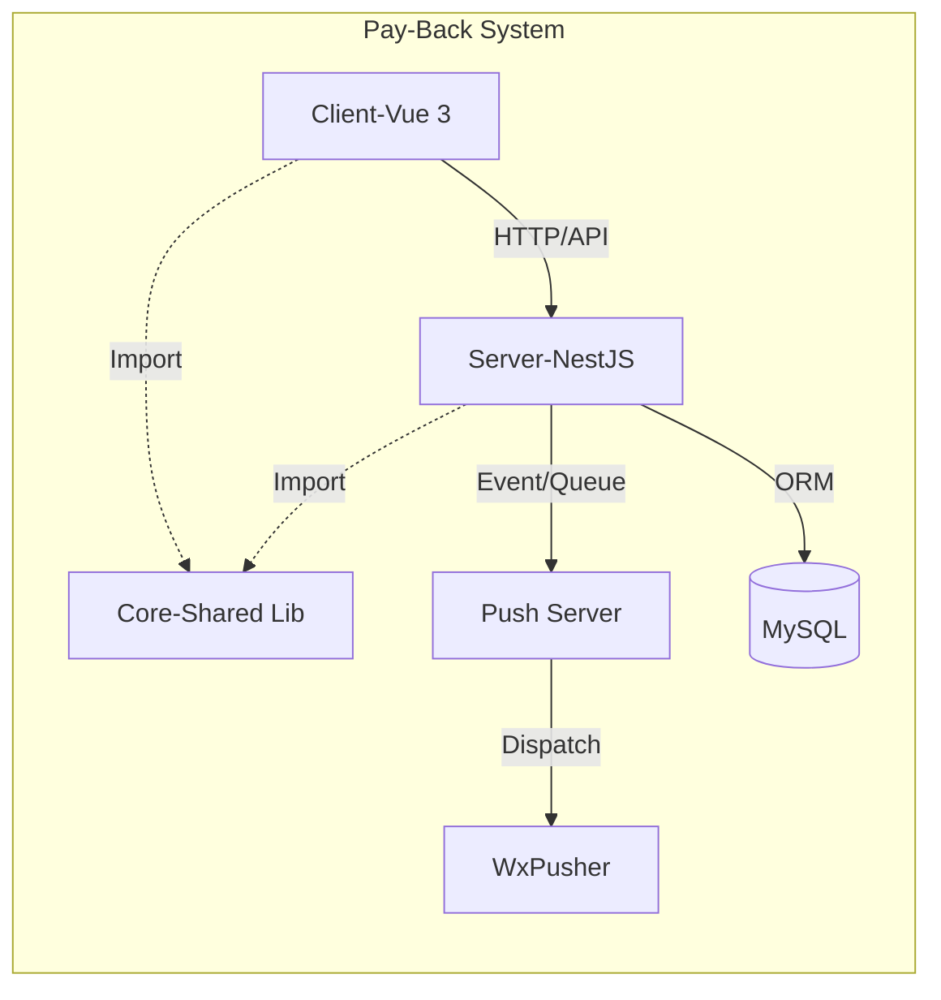
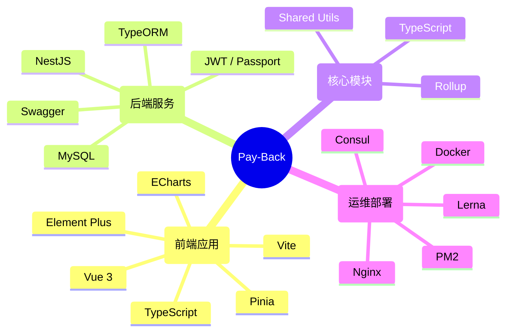
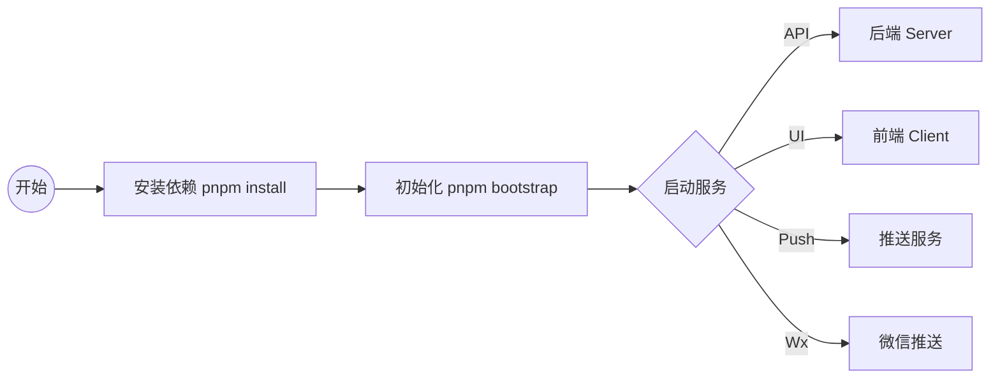

# Pay-Back 项目

一个基于微服务架构的综合性管理系统，采用 Lerna Monorepo 模式进行项目管理。

## 📋 项目概述

Pay-Back 是一个集成了前端管理界面、后端 API 服务、消息推送功能的完整解决方案。项目采用现代化的技术栈，支持模块化开发和独立部署。

## 🏗️ 项目架构

```
pay-back/
├── packages/
│   ├── client/          # 前端应用 (Vue 3 + TypeScript)
│   ├── server/          # 后端API服务 (NestJS)
│   ├── core/            # 前后端共享核心模块
│   ├── push-server/     # 推送服务
│   └── wxPusher/        # 微信推送服务
├── docker-compose.yml   # Docker 编排配置
└── lerna.json          # Monorepo 配置
```

### 系统架构图



## 🚀 技术栈



### 前端 (Client)

- **框架**: Vue 3 + TypeScript
- **构建工具**: Vite
- **UI 组件库**: Element Plus
- **状态管理**: Pinia
- **路由**: Vue Router 4
- **图表**: ECharts
- **编辑器**: v-md-editor

### 后端 (Server)

- **框架**: NestJS
- **数据库**: MySQL + TypeORM
- **认证**: JWT + Passport
- **API 文档**: Swagger
- **任务调度**: @nestjs/schedule
- **微服务**: @nestjs/microservices

### 核心模块 (Core)

- **构建工具**: Rollup
- **语言**: TypeScript
- **功能**: 前后端共享工具函数和类型定义

### 推送服务

- **推送服务**: 基于 NestJS 的微服务架构
- **微信推送**: 集成 Wechaty 实现多渠道消息推送

## 📦 安装依赖

```bash
# 安装根目录依赖
pnpm install

# 安装所有子包依赖
pnpm bootstrap
```

## 🛠️ 开发环境启动



### 启动所有服务

```bash
# 启动后端服务
pnpm start:server

# 启动前端开发服务器
pnpm start:client

# 启动推送服务
pnpm start:pushServer

# 启动微信推送服务
pnpm start:wxPusher
```

### 单独启动服务

```bash
# 进入对应目录启动
cd packages/server && pnpm start
cd packages/client && pnpm start
```

## 🔨 构建部署

### 构建所有包

```bash
pnpm build
```

### 单独构建

```bash
# 构建前端
cd packages/client && pnpm build

# 构建后端
cd packages/server && pnpm build

# 构建核心模块
cd packages/core && pnpm build
```

### Docker 部署

```bash
# 使用 Docker Compose 启动所有服务
docker-compose up -d

# 启动 Consul 服务发现
docker-compose -f docker-compose-consul.yml up -d
```

## 📁 项目结构详解

### Client (前端)

- `src/views/` - 页面组件
- `src/components/` - 通用组件
- `src/api/` - API 接口定义
- `src/store/` - 状态管理
- `src/router/` - 路由配置

### Server (后端)

- `src/article/` - 文章管理模块
- `src/auth/` - 认证授权模块
- `src/pay-back/` - 核心业务模块
- `src/scheduler-task/` - 定时任务
- `src/users/` - 用户管理模块

### Core (核心模块)

- `src/utils/` - 工具函数
- `src/config/` - 配置管理

## 🔧 开发工具配置

### 代码规范

- ESLint - 代码质量检查
- Prettier - 代码格式化
- TypeScript - 类型检查

### Git Hooks

- Husky - Git 钩子管理
- lint-staged - 暂存区代码检查

## 📊 监控与运维

### 前端监控

- Aegis Web SDK - 前端异常监控

### 数据库监控

- MySQL I/O 监控脚本
- 自动重启机制

### 进程管理

- PM2 - 进程守护
- Docker - 容器化部署

## 🔐 环境配置

项目支持多环境配置：

- 开发环境 (development)
- 生产环境 (production)

环境变量文件位于各包的根目录：

- `.env` - 基础配置
- `.env.development` - 开发环境
- `.env.production` - 生产环境

## 📈 功能特性

- ✅ 用户认证与授权
- ✅ 文章管理系统
- ✅ 实时消息推送
- ✅ 微信集成推送
- ✅ 定时任务调度
- ✅ 微服务架构
- ✅ 容器化部署
- ✅ 代码质量检查
- ✅ 类型安全(TypeScript)

## 🤝 贡献指南

1. Fork 本项目
2. 创建功能分支 (`git checkout -b feature/AmazingFeature`)
3. 提交更改 (`git commit -m 'Add some AmazingFeature'`)
4. 推送到分支 (`git push origin feature/AmazingFeature`)
5. 创建 Pull Request

## 📄 许可证

本项目采用 ISC 许可证 - 查看 [LICENSE](packages/client/LICENSE) 文件了解详情。

## 📞 联系方式

- 项目维护者: yxuanzhang@tencent.com
- 项目仓库: [Gitee](https://gitee.com/chongqing-woteng/pay-back.git)

---

**无限未来 (Infinite Future) | 数字前沿 (Digital Frontier) | 云端智造 (Cloud Smart Manufacturing)**
